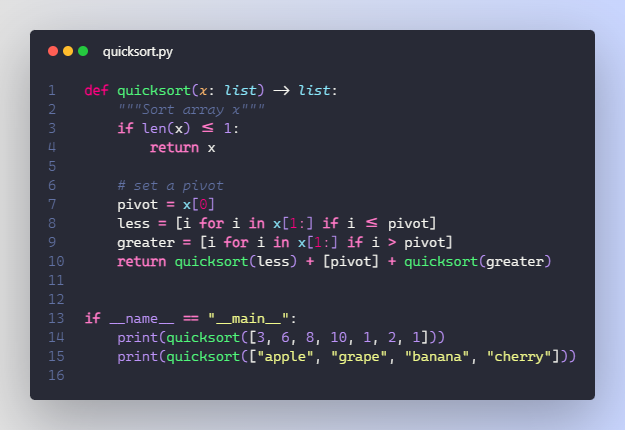
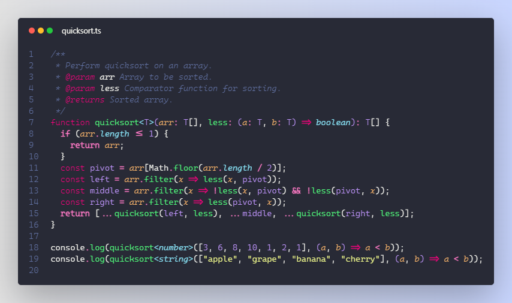
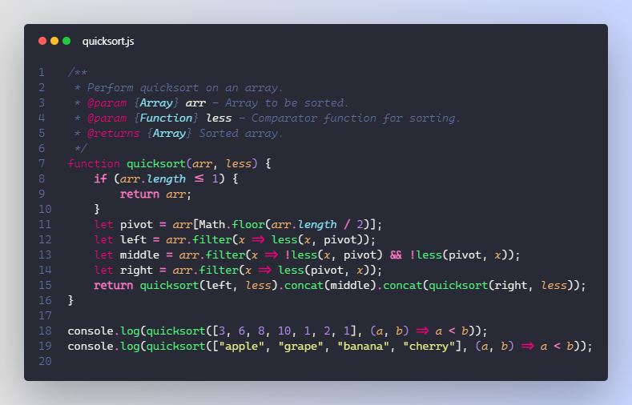
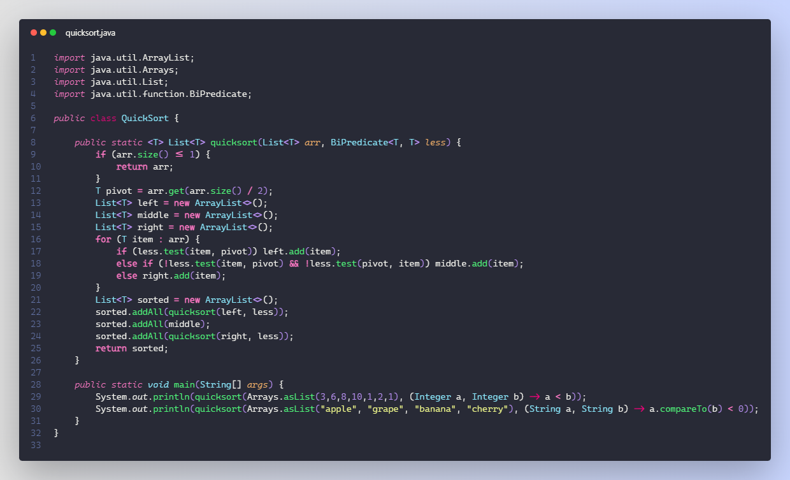
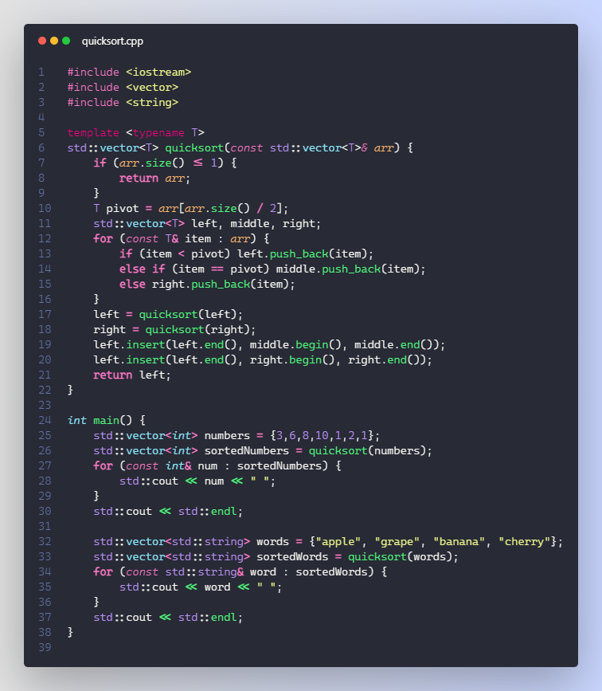
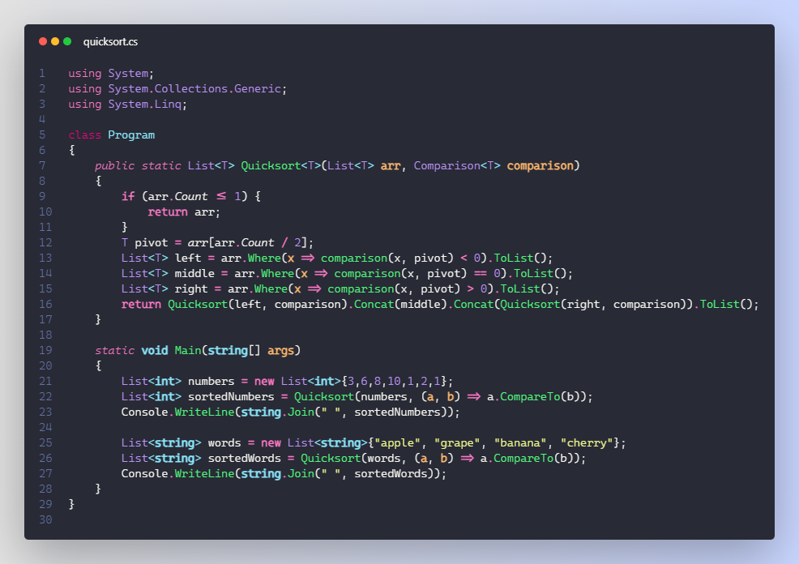
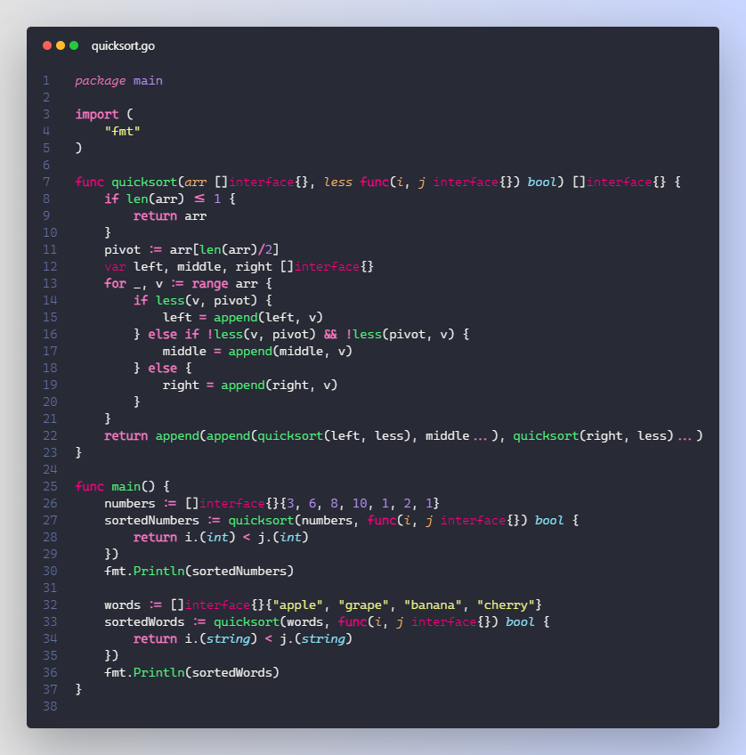
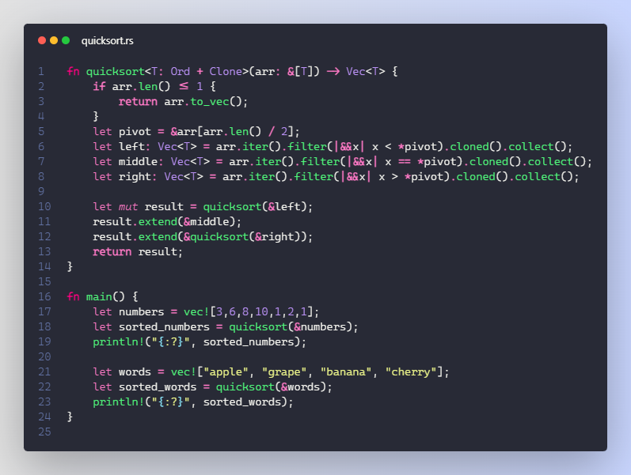

# Dracula Noctis


## TL,DR
This theme takes [Noctis](https://github.com/liviuschera/noctis) syntax highlighting while using the classic [Dracula](https://github.com/dracula/visual-studio-code) palette. The color scheme is slightly altered and is tuned for python and rust. Enjoy!

## Sample Images

Python



Typescript



Javascript



Java



C++



C#



Go



Rust



## Description
I love the syntax highlighting in the [Noctis](https://github.com/liviuschera/noctis) theme by Liviu Schera, but [Dracula](https://github.com/dracula/visual-studio-code) is my favorite theme palette-wise, I tried to combine the two. This is the result! Will continue to update this theme as I adjust and fix things I don't like.

## For a better experience
add bracket pair colorization to your `settings.json`
```
{
    "editor.bracketPairColorization.enabled": true,
    "editor.guides.bracketPairs": "active",
}
```
**Enjoy!**
